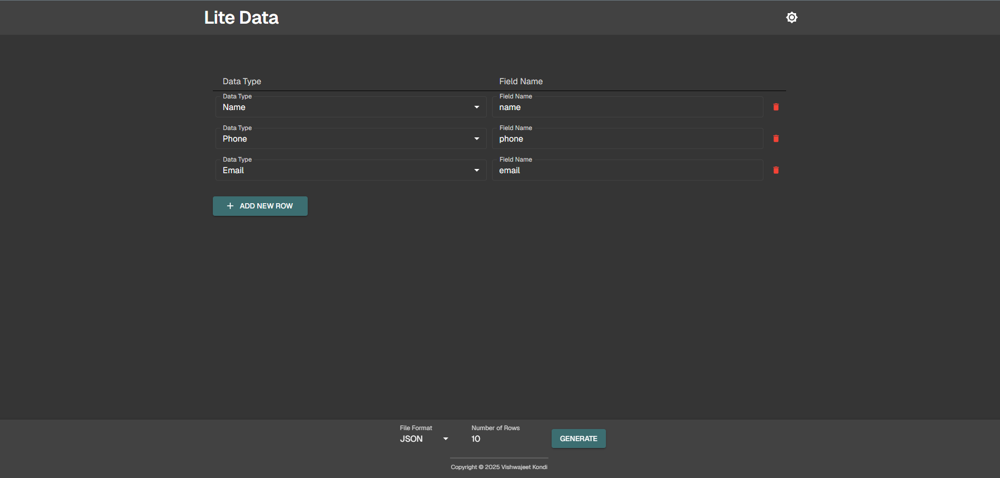
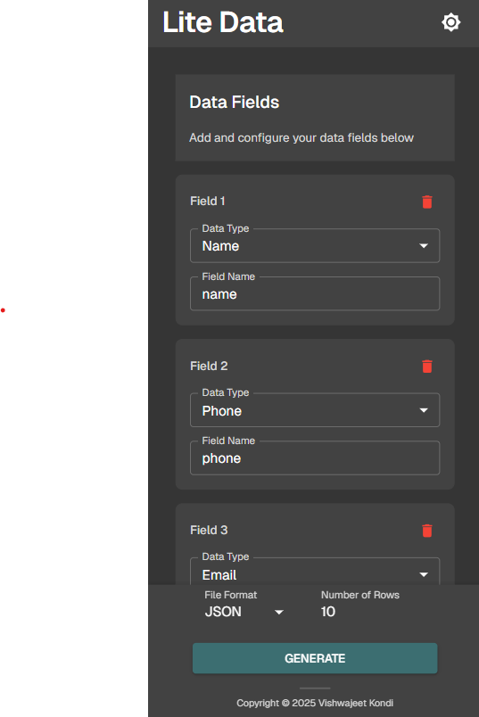

# Lite Data

Lite Data is a modern, full-stack web application for generating and exporting custom datasets in seconds. Designed for developers, analysts, and testers, Lite Data makes it easy to create mock data tailored to your needs.

## Table of Contents
- [Key Features](#key-features)
- [Screenshots](#screenshots)
- [Getting Started](#getting-started)
- [How It Works](#how-it-works)
- [Technologies Used](#technologies-used)
- [Testing](#testing)
- [License](#license)

---

## Key Features
- **Instant Data Generation:** Define fields, types, and row count to generate realistic datasets on the fly.
- **Multiple Export Formats:** Download data as CSV, JSON, XML, HTML, or Excel (XLSX).
- **Customizable Schema:** Add, remove, and configure fields with intuitive controls.
- **Responsive UI:** Enjoy a seamless experience on desktop and mobile devices.
- **One-Click Download:** Export your generated data instantly—no signup required.
- **Modern Design:** Clean, accessible interface with theme support.

---

## Screenshots

**Desktop View**



**Mobile View**



---

## Getting Started

1. **Clone the repository:**
   ```
   git clone https://github.com/vkondi/lite-data.git
   cd lite-data
   ```
2. **Install dependencies:**
   - Node.js packages:
     ```
     yarn install
     ```
   - Python packages:
     ```
     pip install -r requirements.txt
     ```
3. **Start the app:**
   ```
   yarn dev
   ```
   - Frontend: http://localhost:3000
   - Backend: http://localhost:5328

---

## How It Works
1. **Define your data schema:**
   - Add fields and select data types (e.g., name, email, number).
   - Set the number of rows you want to generate.
2. **Choose export format:**
   - Select from CSV, JSON, XML, HTML, or Excel.
3. **Generate & download:**
   - Click "Generate" to instantly download your custom dataset.

---

## Technologies Used
- **Frontend:** Next.js, React, Material-UI
- **Backend:** Flask (Python)
- **Testing:** Vitest, React Testing Library
- **Linting:** ESLint

---

## Testing
To run all tests:
```
yarn test
```

---

## License
MIT License. See [LICENSE](LICENSE) for details.

